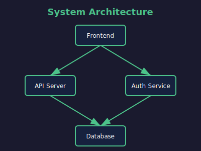

tags:: media, embeds, multimedia

- # Media and Embeds
- This page demonstrates various media embedding features.
- ## Images
	- ### Local SVG Image
		- 
	- ### Logo with Size Attributes
		- {:height 100, :width 200}
	- ### External Image
		- 
- ## YouTube Videos
	- Embed a YouTube video:
	- {{youtube https://www.youtube.com/watch?v=dQw4w9WgXcQ}}
- ## Video Files
	- Local video embed (file not included in example):
	- {{video ../assets/demo.mp4}}
- ## PDF Documents
	- ### Logseq PDF Syntax
		- PDF embed using Logseq's native syntax (file not included in example):
		- {{pdf ../assets/document.pdf}}
	- ### Image Syntax for PDFs
		- Logseq sometimes uses image syntax for PDFs. The preprocessor converts this to an iframe:
		- 
- ## Page Embeds
	- Embed another page's content:
	- {{embed [[Getting Started]]}}
- ## Block Embeds
	- Embed a specific block (requires valid block UUID):
	- {{embed ((12345678-abcd-1234-efgh-123456789abc))}}
- ## Cloze Deletions
	- For flashcards and spaced repetition:
	- The capital of France is {{cloze Paris}}.
	- Water boils at {{cloze 100}} degrees Celsius.
- ## Renderer Blocks
	- Custom renderers (plugin-dependent):
	- {{renderer :custom-plugin, arg1, arg2}}
- ---
- Related: [[Syntax Guide]], [[Getting Started]]
